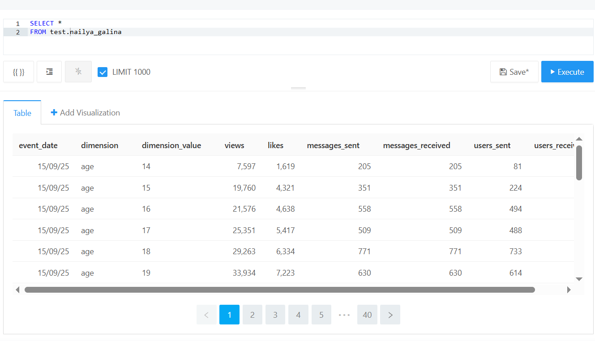

### "Построение ETL-pipeline"   

**Стек:** Airflow, Gitlab, ClickHouse, Pandas, Pandahouse.  

**Описание задачи:**   
Необходимо создать отдельную таблицу в ClickHouse и наладить автоматическое дополнение таблицы новыми данными за прошлый день.

**Необходимо сделать:**   
1. Параллельно обработать две таблицы. В feed_actions для каждого юзера посчитать число просмотров и лайков контента. В message_actions для каждого юзера посчитать, сколько он получает и отсылает сообщений, скольким людям он пишет, сколько людей пишут ему. Каждая выгрузка должна быть в отдельном таске.  
2. Объединить две таблицы в одну.  
3. Для этой таблицы посчитать все эти метрики в разрезе по полу, возрасту и платформы. Сделать три разных таска на каждый срез.  
4. Финальные данные со всеми метриками записать в отдельную таблицу в ClickHouse.  
5. Каждый день таблица должна дополняться новыми данными.  

Структура финальной таблицы:  
- Дата - event_date;  
- Название среза – dimension;  
- Значение среза - dimension_value;  
- Число просмотров – views;  
- Число лайков – likes;  
- Число полученных сообщений - messages_received;  
- Число отправленных сообщений - messages_sent;  
- От скольких пользователей получили сообщения - users_received;  
- Скольким пользователям отправили сообщение - users_sent.  
Срез — это os, gender и age.

**Этапы работы:**  
Написание скрипта для создания таблицы в ClickHouse, настройка автоматического дополнения таблицы новыми данными с помощью Airflow. Размещение кода в Gitlab.

Ознакомиться с файлом решения можно здесь: [ETL-pipeline]( https://github.com/NailyaGalina/Airflow_ETL_pipeline/blob/main/DAG_ETL.py)   

**Результат:**  
Автоматизировано создание таблицы с ежедневным дополнением новыми данными.

 
 

*Проект разработан мной на основе материалов, автор которых - [karpov.courses](https://karpov.courses)
