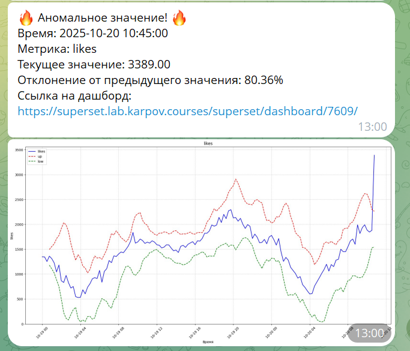
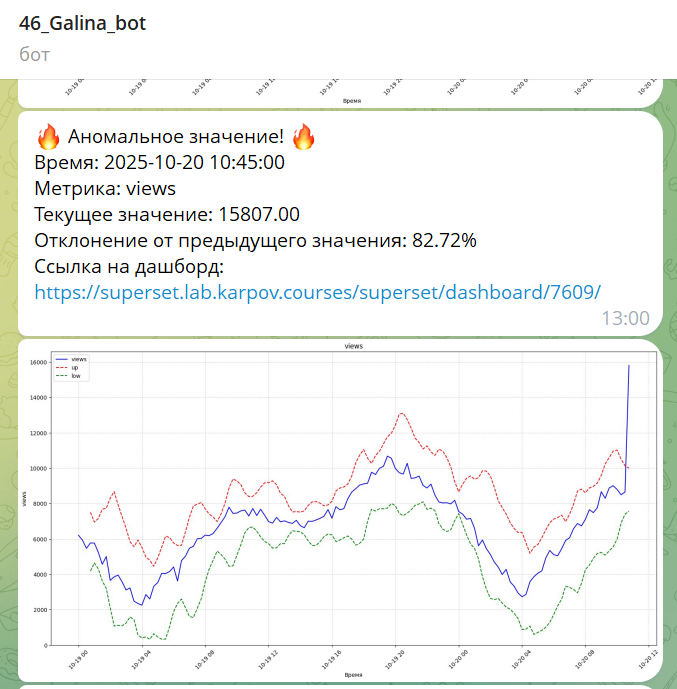
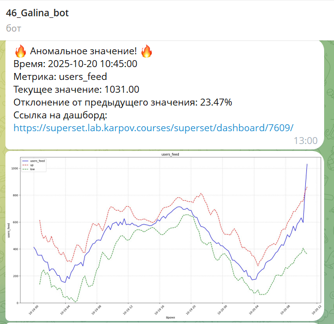
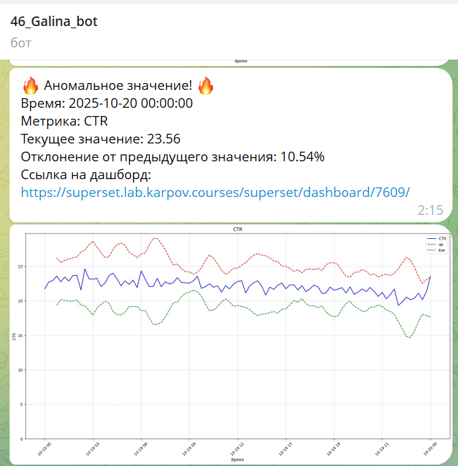
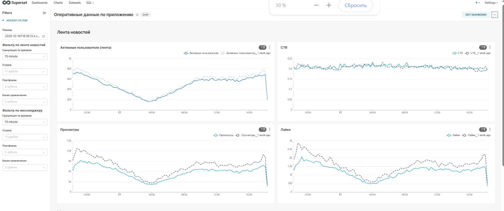
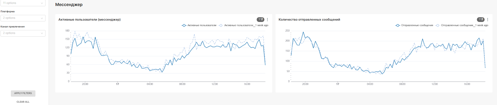

### "Создание системы алертов"   

**Стек:** Airflow, Gitlab, ClickHouse, Pandas, Pandahouse, Matplotlib, Seaborn, Telegram, Superset.  

**Описание задачи:**   
Необходимо создать систему алертов, которая должна с периодичностью каждые 15 минут проверять ключевые метрики приложения.

**Необходимо сделать:**   
1. создать телеграм-бота.  
2. написать скрипт для создания системы алертов, которая должна с периодичностью каждые 15 минут проверять ключевые метрики приложения. Проверка заключается в выявлении отклонения значения метрики в текущую 15-минутку от значения в такую же 15-минутку день назад.
3. должны проверяться следующие ключевые метрики:  
•	DAU в ленте новостей;  
•	DAU в мессенджере;  
•	Просмотры;  
•	Лайки;  
•	CTR;  
•	Количество отправленных сообщений.  
4. создать оперативный дашборд с ключевыми метриками приложения в Superset.
5. в случае обнаружения аномального значения, в телеграм должен отправиться алерт — сообщение со следующей информацией: метрика, ее значение, величина отклонения, ссылка на оперативный дашборд.
6. автоматизировать отправку алерта с помощью Airflow.
7. код системы алертов разместить в GitLab.

**Этапы работы:**  
Написание скрипта для создания системы алертов, создание дашборда в Superset, настройка автоматической отправки алерта с помощью Airflow. Размещение кода в Gitlab.

Ознакомиться с файлом решения можно здесь: [Alert_system](https://github.com/NailyaGalina/Airflow_alert_system/blob/main/Alert_system.py)  

**Результат:**  
Создана система алертов для поиска аномалий.

*Проект разработан мной на основе материалов, автор которых - [karpov.courses](https://karpov.courses)
